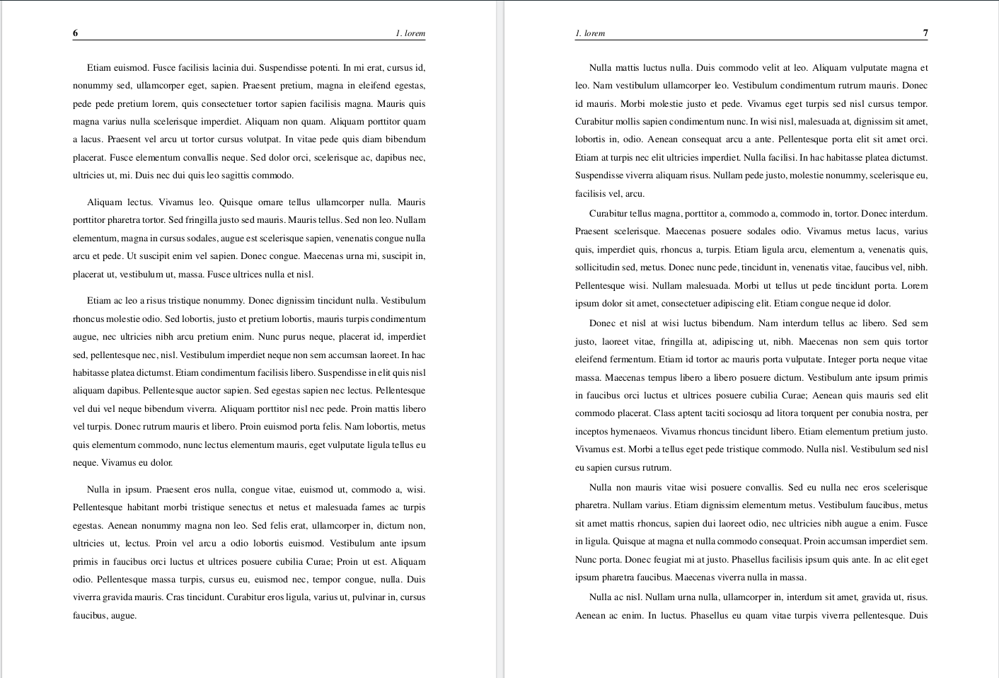
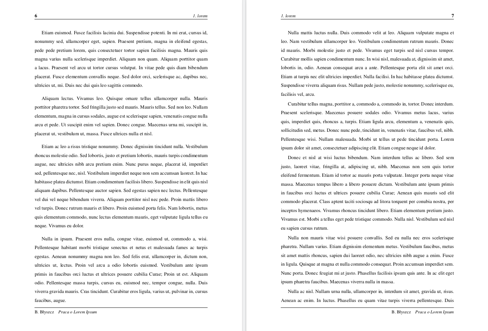
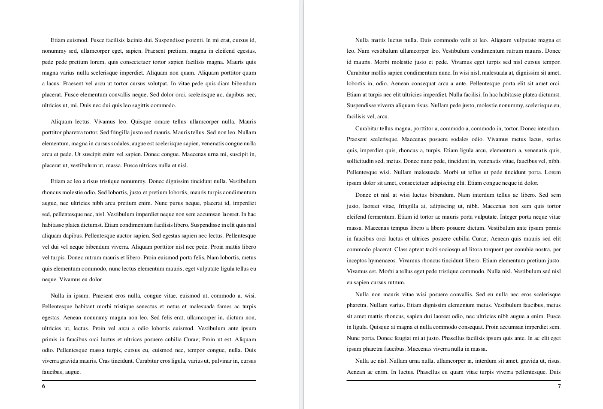
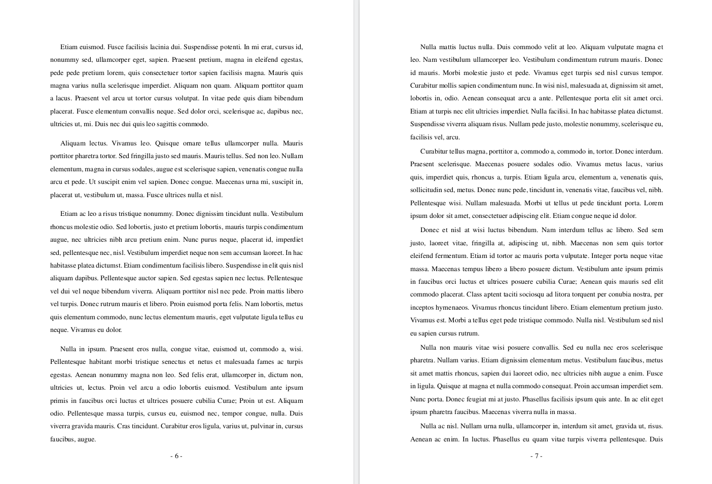

# latex-class
My great latex class

# Header and footer

In class are 3 header style. We can use one of them in main file.
```tex

% --- First Header ---
% \headAndFootWithShort
% \footShort
    
% --- Second Header ---
% \headAndFoot

% --- Third Header ---
% \headAndFootCasual

```


## \headAndFootWithShort and \footShort
With use this tag the pages look:

If we want use short title, we can use `\footShort` too:


in this configuration:
```tex
	\headAndFootWithShort
    \footShort
```

## \headAndFoot
With this tag, the pages look:


## \headAndFootCasual
With this tag, the pages look:



