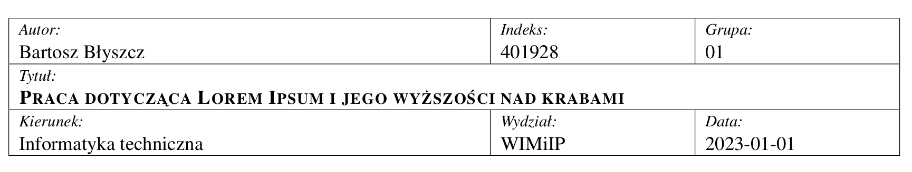

# latex-class
My great latex class

## Header and footer

In class are 3 header style. We can use one of them in main file.
```tex

% --- First Header ---
% \headAndFootWithShort
% \footShort
    
% --- Second Header ---
% \headAndFoot

% --- Third Header ---
% \headAndFootCasual

```


### \headAndFootWithShort and \footShort
With use this tag the pages look:
    
  
If we want use short title, we can use `\footShort` too:


in this configuration:
```tex
\headAndFootWithShort
\footShort
```
    
For `\footShort` we need this marks to config shorts:
```tex
\tShortauthor{B. Błyszcz}
\tShorttitle{Praca o Lorem Ipsum} 
```

### \headAndFoot
With this tag, the pages look:


### \headAndFootCasual
With this tag, the pages look:


## Table title
This title is make for academic report. For config we need this marks

```tex

\author{Bartosz Błyszcz}
\title{Praca dotycząca Lorem Ipsum i jego wyższości nad krabami}
\tIndex{401928}
\tGroup{01}
\tFaculty{WIMiIP}
\tField{Informatyka techniczna}
\date{2023-01-01}

```
  
and this `\tablepage` in document section.



## Fancy title
This title is simple and casual. For config we need this marks

```tex

\author{Bartosz Błyszcz}
\title{Praca dotycząca Lorem Ipsum i jego wyższości nad krabami}
\secTitle{Laboratorium 11}
\date{2023-01-01}

```
  
and this `\fancypage` in document section.
